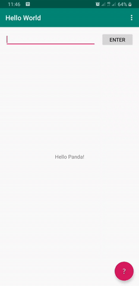

Hello World Android App with Java
==
This is my first Android app developed using Java (and Android Studio). This app is just a Basic Activity template (provided by Android Studio) with addition of text input field and Enter button, following [this documentation](https://developer.android.com/training/basics/firstapp/building-ui "Build a simple user interface  |  Android Developers"). The text input field (and Enter button) add a functionality to change "World" in the "Hello World!" text into whatever entered into the field.

Installation
--
There is currently no APK file in this commit. One will have to clone this repository and run it locally (using Android Studio or other tool).

References
--
* https://developer.android.com/reference/android/R.drawable
* https://developer.android.com/studio/install
* https://developer.android.com/training/basics/firstapp/building-ui
* https://developer.android.com/training/basics/firstapp/starting-activity#java